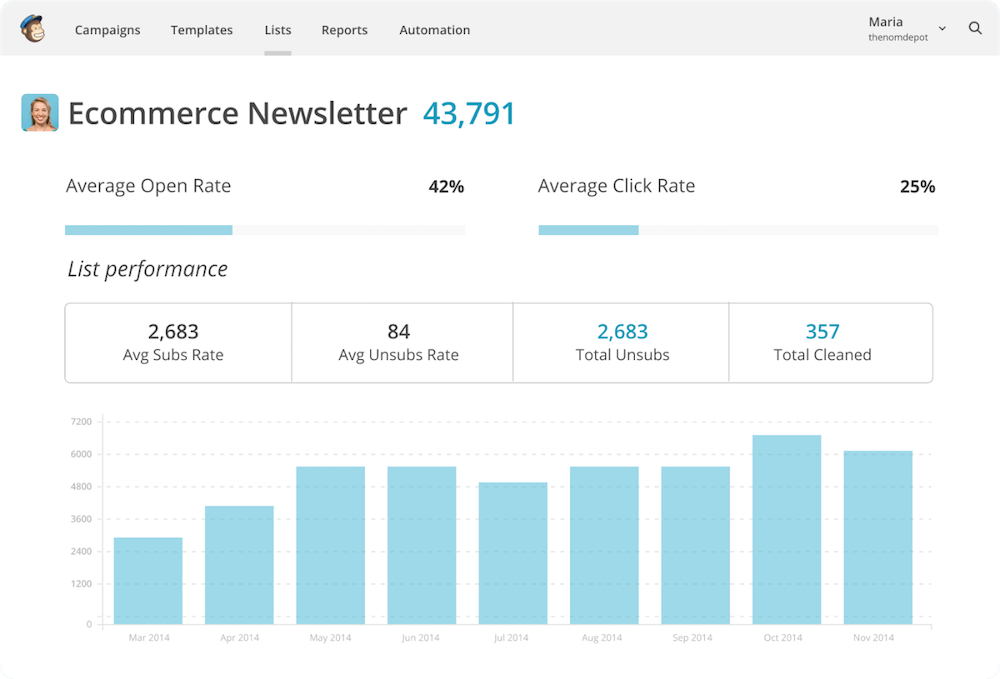
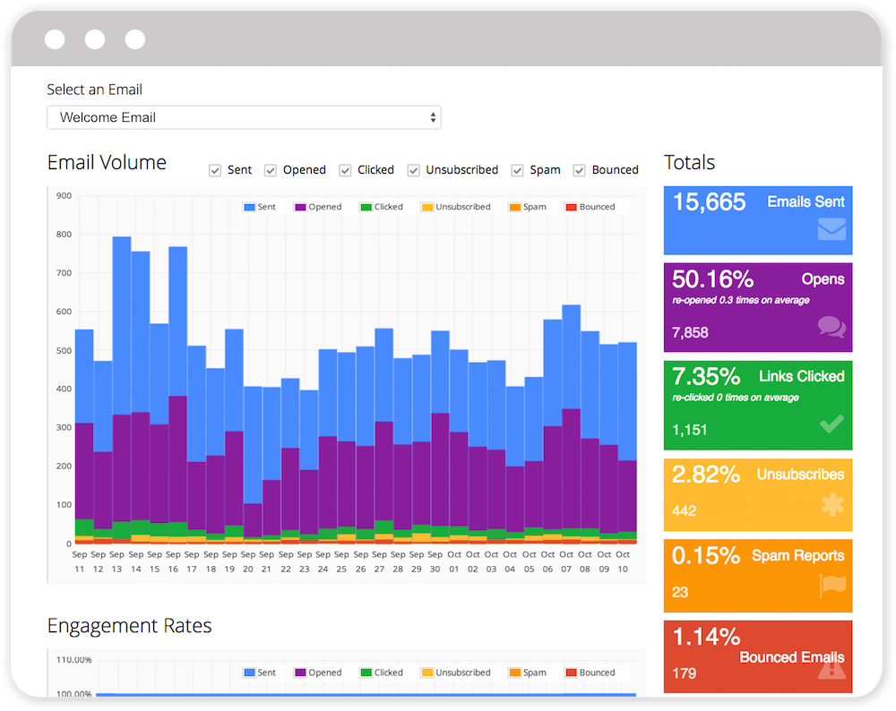
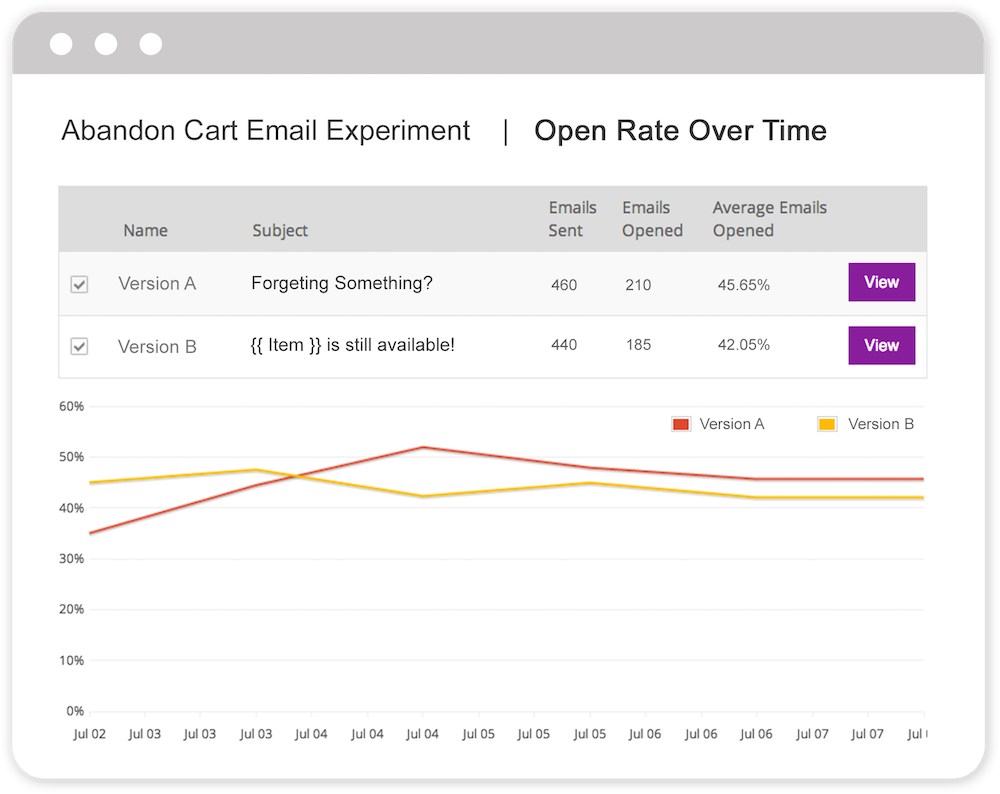
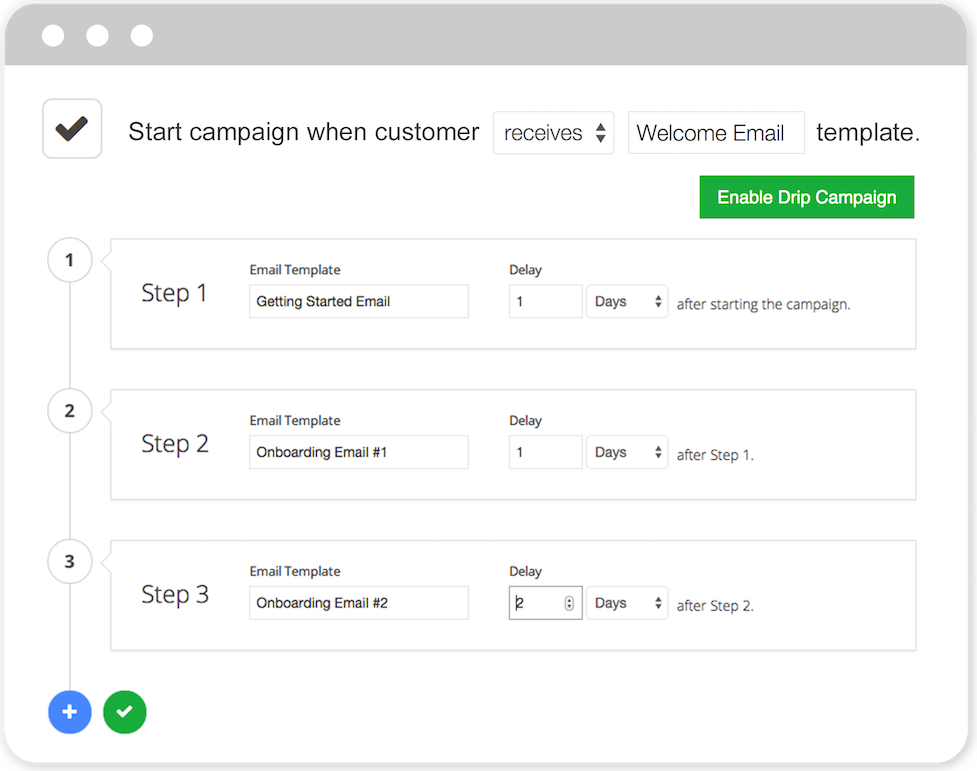

layout: true
.logo[]

---
class: middle, main

# Exploring Marketing Emails
## .blue[Lessons Learned]

.right[@nettofarah]

---
class: fake-middle

# nettofarah

## github.com/nettofarah
## @nettofarah

---
class: fake-middle
# Senior Product Engineer @ IFTTT

---
class: fake-middle
# Emails at IFTTT

---
class: fake-middle
# Mobile is the future, the present

and a little bit of the past

---
class: fake-middle
# What About Email?

The usual way to talk/engage to users

---
class: fake-middle
# Our Main Problem

Standardize dozens of different emails
i.e. language, design, analytics, tools

---
class: fake-middle
# Problems

---
class: fake-middle
# What sort of users should we reach out to?

---
class: fake-middle
# When is the best time to send emails?

---
class: fake-middle
# What sort of content should we show?

---
class: fake-middle
# Should we standardize on content?

---
class: fake-middle, image
# Step 0

## Conversion Funnel (Pirate Metrics)

## AARRR

---
class: fake-middle, no-background, aarrr
# AARRR

.fancy-list[
- Acquisition
- Activation
- Retention
- Revenue
- Referral
]

.fancy-list.roles[
- Marketing
- Marketing + Product
- Product
- Product + BizDev
- Marketing
]

---
class: fake-middle
# Step 1
## Understanding (basic) Email Analytics

Mostly Vanity Metrics (but still useful)

---
class: fake-middle, image, no-logo
# Metrics
.mailchimp[]

(For Illustration Purposes Only)

---
class: fake-middle, image, no-logo
# Metrics

(For Illustration Purposes Only)

---
class: fake-middle
# Delivery Rate

---
class: fake-middle
# Open Rate

---
class: fake-middle
# Click Through Rate

---
class: fake-middle
# Unsubscribe Rate

---
class: fake-middle
# Spam Reports

---
class: fake-middle
# Conversion Rate

Your own metric HERE

---
class: fake-middle
# Step 2
## Email Marketers/Engineers/Hackers Toolbelt

for effective communication

---
class: fake-middle
# A/B Testing

- How to A/B test emails?
- What to test?
- Understading your audience, sample size, statistical significance

---
class: fake-middle, no-logo, image
# Design

(For Illustration Purposes Only)

---
class: fake-middle
# A/B Testing

Content, Subject Line

---
class: fake-middle
# A/B Testing

Delivery Time

---
class: fake-middle, no-logo, image
# Drip Campaigns

(For Illustration Purposes Only)
---
class: fake-middle
# Event Based Engagement Campaigns

---
class: fake-middle
# Segmentation

---
class: fake-middle
# Some Products Worth Checking Out

- Sendgrid
- SendWithUs
- CampaignMonitor
- Customer.io

---
class: fake-middle
# Hacks and Lessons we Learned Along the Way

---
class: fake-middle
# Personalized Content

Beats standard email

---
class: fake-middle
# The Inbox Stack

`Our Awesome Company Loves You (32)`

---
class: fake-middle
# Semi-Logged in Emails

Reduce the steps of your funnel

---
class: fake-middle
# Don't Oversell

---
class: fake-middle
# Common Sense

---
class: fake-middle
# Questions?
